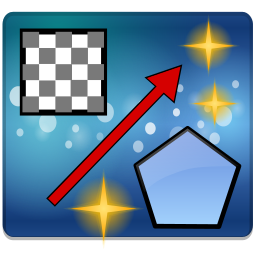

# Linia - Linux Image Annotator

**Linia** (short for **Lin**ux **I**mage **A**nnotator) is an image annotation application built with Perl and GTK3. Designed for Linux users who need annotation tools for screenshots, images, and diagrams. Linia has a comprehensive set of drawing tools and effects.


## Features

Linia introduces unique .linia project file format with complete undo/redo history across sessions. Close the app, reopen tomorrow, and still undo annotations from days ago. This means: 

- Non-Destructive Editing - Original image remains untouched

- Complete Session Persistence - Save and resume work across days, weeks, or months

- Full Undo/Redo History - All annotations remain undoable even after closing and reopening

- Complete Editability - Modify any annotation at any time
- JSON-Based - Human-readable format for easy debugging

What's Saved:

- Original image path reference
- Canvas dimensions
- All annotations (lines, shapes, text, etc.)
- Complete undo/redo stack 
- Colors and transparency settings
- Line styles and widths
- Font information
- Layer order and anchoring status


### Drawing Tools

#### Basic Shapes
- **Line** - Draw straight lines with support for horizontal/vertical constraints
- **Single Arrow** - Draw arrows pointing in one direction
- **Double Arrow** - Draw arrows with arrowheads on both ends
- **Rectangle** - Draw rectangular shapes with fill and stroke
- **Ellipse** - Draw circular and elliptical shapes
- **Triangle** - Draw triangles with adjustable vertices
- **Tetragon** - Draw four-sided polygons
- **Pentagon** - Draw five-sided polygons

#### 3D Objects
- **Pyramid** - Draw 3D pyramids with realistic lighting and shading
- **Cuboid** - Draw 3D rectangular prisms with perspective


#### Special Tools
- **Text Annotations** - Rich text with custom fonts, sizes, colors, and styles
- **Numbered Circles** - Auto-incrementing numbered markers for step-by-step guides
  - **Auto-increment**: Each new circle automatically gets the next number in sequence
  - **Attribute inheritance**: New circles inherit size, colors, line style, and line width from current tool settings
  - **Restart sequence**: Right-click any circle → "Anchor Sequence (Reset Count)" to restart from 1
  - **Individual control**: Right-click a circle → "Anchor"/"Unanchor" to include/exclude from sequence
- **Magnifier** - Zoom in on specific image areas with adjustable magnification
- **Pixelization** - Blur sensitive information with adjustable pixel size
- **SVG Import** - Import and place vector graphics from SVG files


### Selection & Manipulation

- **Multi-select** - Hold Shift and click to select multiple items
- **Grouped operations** - Move, resize, copy, or delete multiple items at once
- **Precise positioning** - Drag handles for exact placement and sizing
- **Constrained drawing** - Hold Ctrl for squares/circles, Shift for straight lines
- **Resize from center** - Hold Ctrl while dragging handles

### Widget Toolbar

The widget toolbar provides extensive customization options:

#### Line Styling
- **Line Style** - Choose from 5 different styles:
  - Solid Line
  - Dashed Line
  - Dotted Line
  - Dash Dot
  - Long Dash
- **Line Width** - Adjustable from 0.5 to 50.0 pixels

#### Colors
- **Fill Color** - Set fill color for shapes with alpha transparency
- **Fill Transparency** - Adjust fill transparency (0-100%)
- **Stroke Color** - Set outline color with alpha transparency
- **Stroke Transparency** - Adjust stroke transparency (0-100%)

#### Text Formatting
- **Font Selection** - Choose font family, size, and style for text annotations

#### Visual Effects
Linia features a unique **inverse dimming** system that highlights specific areas by dimming everything else:

**How It Works:**
1. Draw **rectangles, ellipses, triangles, tetragons, pentagons, or pyramids** around areas you want to highlight
2. Adjust the **"Dim" slider** in the widget toolbar (0-100%)
3. Everything **outside** your shapes becomes dimmed/darkened
4. Your highlighted areas remain at full brightness

**Use Cases:**
- **Tutorial screenshots** - Focus attention on specific UI elements
- **Step-by-step guides** - Highlight the relevant area for each step
- **Documentation** - Draw attention to important parts of complex images
- **Privacy + focus** - Combine with pixelization to blur AND dim irrelevant areas

**Supported Shapes for Dimming:**
- Rectangles
- Ellipses  
- Triangles
- Tetragons
- Pentagons
- Pyramids

**Note:** The dimming effect is visible in the editor and is preserved when exporting the image.


### Other Features

#### Editing & Manipulation
- **Undo/Redo** - Full undo/redo support
- **Copy/Cut/Paste** - Standard clipboard operations for annotations
- **Anchoring** - Lock annotations in place to prevent accidental modification and to draw on top of annotations
- **Layering** - Raise/lower annotations with automatic z-ordering
- **Multi-selection** - Hold Shift to select multiple annotations

#### Zoom & Navigation
- **Smooth Zooming** - Scroll wheel zooming with focal point preservation
- **Zoom Controls** - Zoom in, zoom out, original size (100%), best fit
- **Keyboard Shortcuts** - Quick zoom with Ctrl+Plus/Minus, Ctrl+1, Ctrl+2
- **Panning** - Middle-click drag to pan around large images

#### File Operations
- **SVG Import** - Import and resize SVG graphics
- **Recent Files** - Quick access to recently opened images with thumbnails
- **Save As** - Export annotated images as PNG or JPEG
- **Print** - Direct printing support
- **Clipboard** - Copy annotated image to clipboard (Ctrl+Shift+C)
- **Dimmed Export** - Includes inverse dimming effects in exported image

#### User Interface
- **Centered Toolbars** - All toolbars are centered for easy access in fullscreen mode
- **Customizable Layout** - Toggle drawing toolbar between top and left positions
- **Icon Size Control** - Adjust toolbar icon sizes (16-64px) for accessibility
- **HiDPI Support** - Crisp rendering on high-resolution displays
- **Window Persistence** - Remembers window size and position between sessions

#### Context Menus
Right-click on any annotation to access:

- Handle size
- Delete
- Anchor/Unanchor
- Bring to Front/Send to Back
- Show Measurements (for lines, rectangles, pyramids)
- Add Intersection (for pyramids)

#### Measurements
Display pixel dimensions and measurements directly on annotations:
- Line lengths
- Rectangle dimensions
- Pyramid heights and base measurements

#### Smart Editing
- **Curved Arrows** - Click arrow midpoint to create curved arrows
- **Vertex Editing** - Modify polygon vertices with drag handles
- **Proportional Resize** - Hold Shift while resizing to maintain aspect ratio
- **Constrained Drawing** - Hold Ctrl for horizontal lines, Shift for vertical lines

#### Customization

- **Icon Themes** - Dark or light toolbar icons
- **Icon Sizes** - Adjustable toolbar icon sizes
- **Toolbar Position** - Drawing toolbar can be placed on top or left side
- **Recent Files** - Quick access to recently opened images
- **Keyboard Shortcuts** - Extensive keyboard shortcut support


## Installation

### Prerequisites

**Required Perl Modules:**
- `Gtk3` - GTK3 Perl bindings
- `Cairo` - Cairo graphics library bindings
- `Pango` - Text rendering
- `Image::Magick` - Image processing
- `XML::Simple` - XML parsing for SVG support

```bash
# Ubuntu/Debian
sudo apt-get install libgtk3-perl libcairo-perl libpango-perl \
                     libglib-perl libimage-magick-perl libjson-perl

# Fedora/RHEL
sudo dnf install perl-Gtk3 perl-Cairo perl-Pango perl-Glib \
                 perl-Image-Magick perl-JSON

# Arch Linux
sudo pacman -S perl-gtk3 perl-cairo perl-pango perl-glib imagemagick perl-json
```

### Download & Install

```bash
# Clone the repository
git clone https://github.com/crojack/linia.git
cd linia

# Run the install script
chmod +x install.sh
./install.sh
```

The install script will:
- Install `linia` to `~/.local/bin/linia`
- Create configuration directory at `~/.config/linia/`
- Copy all icons, callouts, objects, and SVG files
- Install application icon to `~/.local/share/icons/`
- Create desktop menu entry (Graphics category)
- Register `.linia` file association
- Set correct permissions
- Update desktop, MIME, and icon databases

**Note:** Make sure `~/.local/bin` is in your PATH. If not, add to `~/.bashrc` or `~/.zshrc`:

```bash
export PATH="$HOME/.local/bin:$PATH"
```

After installation, Linia will be integrated with your desktop environment:
- **Application Menu** - Find Linia in your application launcher (Graphics category)
- **File Associations** - Right-click images and select "Open with Linia"
- **Double-click .linia files** - Project files open directly in Linia
- **System Icon** - Professional icon in menus and launchers

*Note: You may need to log out and log back in for the menu entry to appear in some desktop environments.*

### Manual Installation

```bash
# Clone the repository
git clone https://github.com/crojack/linia.git
cd linia

# Copy executable
cp linia.pl ~/.local/bin/linia
chmod 755 ~/.local/bin/linia

# Create config directory and copy files
mkdir -p ~/.config/linia/{callouts,icons/toolbar-icons,icons/application-icon,objects,svgs,thumbnails}
cp -r callouts/* ~/.config/linia/callouts/
cp -r icons/toolbar-icons/* ~/.config/linia/icons/toolbar-icons/
cp -r icons/application-icon/* ~/.config/linia/icons/application-icon/
cp -r icons/mime-icons/* ~/.config/linia/icons/mime-icons/
cp -r objects/* ~/.config/linia/objects/
cp -r svgs/* ~/.config/linia/svgs/
```

### Running Linia

**From Application Menu:**
- Open your application launcher
- Navigate to Graphics category
- Click on "Linia"

**From Command Line:**
```bash
# After installation
linia

# Open an image directly
linia /path/to/image.png

# Open a project file
linia /path/to/project.linia
```

**From File Manager:**
- Right-click any image file
- Select "Open with Linia"
- Or double-click any `.linia` project file

### Uninstall

```bash
cd linia
chmod +x uninstall.sh
./uninstall.sh
```

The uninstall script will remove the executable and optionally remove your configuration directory.

## Usage

### Basic Workflow

1. **Open Image** - Click "Open Image" to load an image file
2. **Select Tool** - Choose from the drawing toolbar on the left
3. **Draw Annotation** - Click and drag to create the annotation
4. **Customize** - Adjust colors, line width, fill, etc. in the widget toolbar
5. **Save Project** - Click "Save Project" to save as `.linia` file (preserves all annotations for future editing)
6. **Export Image** - Click "Export Image As" to save final annotated image as PNG/JPEG

### Working with .linia Project Files

Linia's project file format (.linia) is a game-changer for annotation workflows:

**Save as Project:**
- `File → Save Project` - Saves your work as a `.linia` file
- Preserves the original image reference
- Stores all annotations with complete editing capability
- Maintains undo/redo history
- Keeps all colors, styles, and settings

**Open Project:**
- `File → Open Project` - Load a previously saved `.linia` file
- All annotations are fully editable
- Continue exactly where you left off
- Modify, delete, or add new annotations
- No fear of losing your work!

**Workflow Example:**
```
Day 1: Create 20 annotations → Save as "tutorial.linia"
Day 2: Open "tutorial.linia" → Add 10 more annotations → Undo last 5 → Save
Day 3: Open "tutorial.linia" → Undo 3 annotations from Day 1 (yes, still possible!) → Save
Day 4: Open "tutorial.linia" → Redo those 3 annotations → Export as "tutorial.png"
```

**The Power of Persistent Undo:**
- Made a mistake last week? No problem - open the .linia file and undo it
- Want to try different annotation styles? Experiment freely, knowing you can always undo
- You want changes? Open the project and modify anything, even annotations from the first session

This is perfect for:
- Long-term projects that need multiple editing sessions
- Tutorial creation where you might need to make revisions days later
- Collaborative work (share .linia files)
- Keeping a master copy with editable annotations
- Workflows where changes are inevitable

### Keyboard Shortcuts

#### Zoom
- `Ctrl + Plus` - Zoom in
- `Ctrl + Minus` - Zoom out
- `Ctrl + 1` - Original size (100%)
- `Ctrl + 2` - Best fit
- `Scroll Wheel` - Zoom in/out at mouse position

#### Editing
- `Ctrl + C` - Copy selected annotation
- `Ctrl + X` - Cut selected annotation
- `Ctrl + V` - Paste annotation
- `Ctrl + Z` - Undo
- `Ctrl + Y` - Redo
- `Delete` - Delete selected annotation

#### Resizing Selected Items
- `Alt + Plus` - Enlarge selected annotation
- `Alt + Minus` - Shrink selected annotation

#### Drawing Constraints
- `Ctrl + Drag` - Constrain to horizontal (for lines/arrows)
- `Shift + Drag` - Constrain to vertical (for lines/arrows)
- `Shift + Click` - Multi-select annotations

#### Navigation
- `Middle Mouse + Drag` - Pan around image
- `Right Click` - Open context menu

## Configuration

Linia stores all configuration and resources in `~/.config/linia/`:

```
~/.config/linia/
├── callouts/              # Callout bubble SVGs (30 variations)
├── emojis/                # Emoji resources (reserved for future use)
├── icons/
│   ├── application-icon/  # Linia application icon
│   ├── mime-icons/        # Linia mime types icons
│   └── toolbar-icons/     # All toolbar button icons
├── objects/               # Drawable objects (stars, warnings, etc.)
├── svgs/                  # SVG library for quick import
├── thumbnails/            # Cached thumbnails of recent files
├── config.json            # Application configuration
├── icon_sizes.txt         # Toolbar icon size preferences
├── recent_files.txt       # Recent files list
└── window_dimensions.txt  # Window size and position
```

**User-configurable settings:**
- Window size and position (saved automatically)
- Toolbar icon sizes (16-64px)
- Drawing toolbar position (left/top)
- Recent files history (up to 10 files)

**Note:** Thumbnails are generated automatically and can be safely deleted - they will be regenerated when needed.

## Tips & Tricks

### Creating Curved Arrows
1. Draw a straight arrow
2. Click the midpoint handle
3. Drag to create a curve
4. Adjust the control point for perfect curves

### Quick Numbering
1. Select the "Number" tool
2. Click anywhere to place a numbered circle
3. Numbers auto-increment (1, 2, 3, ...)
  - **Attribute inheritance**: New circles inherit size, colors, line style, and line width from current tool settings
  - **Restart sequence**: Right-click any circle → "Anchor Sequence (Reset Count)" to restart from 1
  - **Individual control**: Right-click a circle → "Anchor"/"Unanchor" to include/exclude from sequence
4. Perfect for step-by-step tutorials

### Privacy Protection
Use the **Pixelize** tool to blur sensitive information:
- Email addresses
- Phone numbers
- Personal data
- Faces (for privacy)

## Contributing

Contributions are welcome! Please feel free to submit a Pull Request.

## License

This project is licensed under the GPL-3.0 License - see the LICENSE file for details.

## Author

**Željko Vukman**

Contact: zeljko.vukman@outlook.com

## Acknowledgments

Special thanks to these open source communities:

- Perl 5
- GTK3 (GUI toolkit)
- Cairo (2D graphics)
- Pango (text rendering)
- Image::Magick (image processing)

## Support

If you encounter any issues or have feature requests, please open an issue on GitHub.

---
